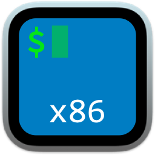
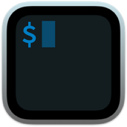
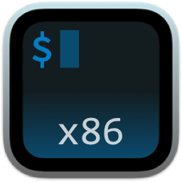

# icons
A few icons I've created/modified for personal use

## iTerm 2 Rosetta

<table>
  <thead>
    <tr><td>Name</td><td>Preview</td></tr>
  </thead>
  <tbody>
    <tr>
      <td>Intel Plain</td>
      <td></td>
    </tr>
     <tr>
      <td>Intel Subtle</td>
      <td></td>
    </tr>
     <tr>
      <td>Intel Subtle Alt</td>
      <td></td>
    </tr>
  </tbody>
</table>